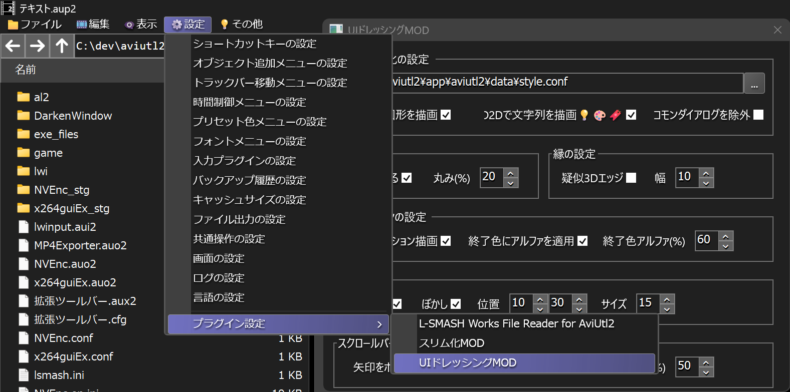

# 🐍AviUtl2 UIドレッシングMOD

* aviutl2の見た目(UI)を統一するMODです。
* aviutl2の入力プラグインの形式になっていますが、実際には見た目を変えるタイプのMODです。
* 「ドレッシング」には「化粧仕上げ」「応急手当」といった意味があるらしいです。



> [!IMPORTANT]
> * 古い出力プラグインのUIには対応していません。
>	* `コモンダイアログを除外`にチェックを入れるか、<br>
>	対応バージョンの出力プラグインを使用してください。

## 🚧注意事項

* 見た目を変えるのはメインスレッドのUIだけです。
* 「ファイルのプロパティ」ダイアログなどは対象外です。

## 🚀インストール

* `プラグインフォルダ`に以下のファイルを入れてください。
	* `al2` ✏️フォルダ
		* `al2_ui_dressing.aui2` ✏️入力プラグインファイル
		* `al2_ui_dressing` ✏️フォルダ
			* `DarkenWindow.aul` ✏️互換用ダミーファイル
			* `assets` ✏️フォルダ
				* `custom_color.conf` ✏️カスタムスタイルの初期値

## 🔥アンインストール

* `プラグインフォルダ`から以下のファイルを削除してください。
	* `al2` ✏️フォルダ
		* `al2_ui_dressing.aui2` ✏️このファイルを削除
		* `al2_ui_dressing` ✏️このフォルダを削除
	* `DarkenWindow` ✏️このフォルダを削除

## 🔧設定項目

* `ダークモード化の設定`
	* `スタイルファイルのパス`✏️現在開いているスタイルファイルのパスが表示されます。
		* `...`ボタンで読み込むスタイルファイルを変更できます。
		* 現在開いているスタイルファイルが編集されると自動的に再読み込みされます。
		* **※ただし、新しい配色が反映されるのは一部(メニュー・スクロールバー・ダイアログなど)だけです。**
	* `D2Dで図形を描画`✏️チェックを入れるとDirect2Dを使用してグラデーションを描画します。
	* `D2Dで文字列を描画`✏️チェックを入れるとDirectWriteを使用してテキストを描画します。
		* 現時点では`メニュー`・`ボタン`・`スタティックテキスト`だけが対象です。
	* `コモンダイアログを除外`✏️チェックを入れるとコモンダイアログをダークモード化しないようにします。
		* **※一部はaviutl2を再起動しないと正常に描画されない場合があるので注意してください。**
* `丸みの設定`
	* `角を丸める`✏️チェックを入れると一部のコントロールに`丸み(%)`が適用されて描画されます。
	* `丸み(%)`✏️角の丸みを%単位で指定します。
* `縁の設定`
	* `疑似3Dエッジ`✏️チェックを入れると一部のコントロールの縁が浮かび上がるように描画されます。
	* `縁の幅(1/10)`✏️縁の幅を**0.1px**単位で指定します。
		* ※ただし、実質機能しません。太くすると描画が破綻する場合があります。
* `グラデーションの設定`✏️`D2Dで図形を描画`を有効化しているときにだけ適用されます。
	* `グラデーション描画`✏️チェックを入れると一部のコントロールがグラデーション描画されます。
	* `終了色にアルファを適用`✏️チェックを入れるとグラデーション終了色に`終了色アルファ(%)`が適用されます。
	* `終了色アルファ(%)`✏️グラデーション終了色に適用するアルファを指定します。
		* `終了色アルファ`は単一色でグラデーション効果を発生させるために使用されます。
* `影の設定`✏️`ぼかし`は`D2Dで文字列を描画`を有効化しているときにだけ適用されます。
	* `影の描画`✏️チェックを入れると一部のコントロールのテキストに影が描画されます。
	* `ぼかし`✏️チェックを入れると影にガウスぼかしが適用されて描画されます。
	* `位置`✏️影の位置を**0.1px**単位で指定します。
	* `サイズ`✏️ぼかしのサイズを**0.1px**単位で指定します。
* `スクロールバーの設定`
	* `矢印をボタンとして描画`✏️チェックを入れるとスクロールバーの矢印をボタンとして描画します。
	* `つまみのグリッパーを描画`✏️チェックを入れるとスクロールバーのつまみにグリッパーを描画します。
	* `太さ(%)`✏️スクロールバーの太さを%単位で指定します。

### 🏷️設定を初期化する

1. aviutl2を起動していない状態で`プラグインフォルダ\al2\al2_ui_dressing\config\al2_ui_dressing.json`を削除します。

## 📝スタイルファイル

* このプラグインは以下の流れでスタイルファイルを読み込みます。
	1. まず、`aviutl2.exeがあるフォルダ\data\style.conf`を読み込みます。
	1. 読み込めなかった場合は、代わりに`C:\ProgramData\aviutl2\style.conf`を読み込みます。
	1. 読み込めなかった場合は、代わりに`aviutl2.exeがあるフォルダ\style.conf`を読み込みます。

## 📝独自スタイルファイル

1. `プラグインフォルダ\al2\al2_ui_dressing\config\custom_color.conf`をテキストエディタで編集します。

> [!IMPORTANT]
> * メニューなど一部の配色だけ変更できます。aviutl2本体の配色は変更できません。

### 書式

* `utf-8`の`iniファイル`のようなファイル形式になっています。
* `セクション`✏️主にコントロールまたはそのパーツの名称になっています。
* `キー`✏️主にコントロールのステートの名称になっています。
	* `サフィックス`
		* `Fill`✏️背景の色です。
		* `Edge`✏️縁の色です。
		* `Text`✏️テキストの色です。
		* `TextShadow`✏️テキストの影の色です。
* `色の値`
	* `rrggbb`または`rrggbbaa`形式の16進数で指定します。
	* ※ただし、アルファが使用されるのはDirect2Dで描画する場合だけです。

### 例

* エディットボックスの選択色を赤に変更します。

```ini
[EditBox]
SelectFill=ff0000
```

---

* 透過グラデーションが適用されないようにします。(終了色を指定します)

```ini
[TrackBarThumb]
NormalFill=,101010
```

---

* 縁が描画されないようにします。(縁のアルファを0にします)

```ini
[MenuItem]
HotEdge=00000000
```

---

* `疑似3DEdge`をカスタマイズします。
* 縁の左上の色をアルファ0x66の割合で白とブレンドします。
* 縁の右下の色をアルファ0x77の割合で黒とブレンドします。

```ini
[3DEdge]
Raised=ffffff66,00000077
```

---

* 縁の陰影を個別に変更します。
* 縁の左上をアルファ0x40の白に変更します。
* 縁の右下をアルファ0x80の黒に変更します。

```ini
HotEdge=ffffff40,00000080
```

---

* `共通のテキストの影`をカスタマイズします。
* すべてのテキストの影をアルファ0xccの青で描画します。

```ini
[Common]
TextShadow=0000ffcc
```

---

* テキストの影を個別にカスタマイズします。
* テキストの影をアルファ0x80の赤で描画します。
* ただし、ホット状態のボタンだけに適用されます。
* その他の状態は`共通のテキストの影`の設定で描画されます。

```ini
[Button]
HotTextShadow=ff000080
```

## 🔖更新履歴

* 🔖r2 #2026年02月04日
	* 🚚サブモジュール化

* 🔖r1 #2026年01月31日
	* 🎉初版
